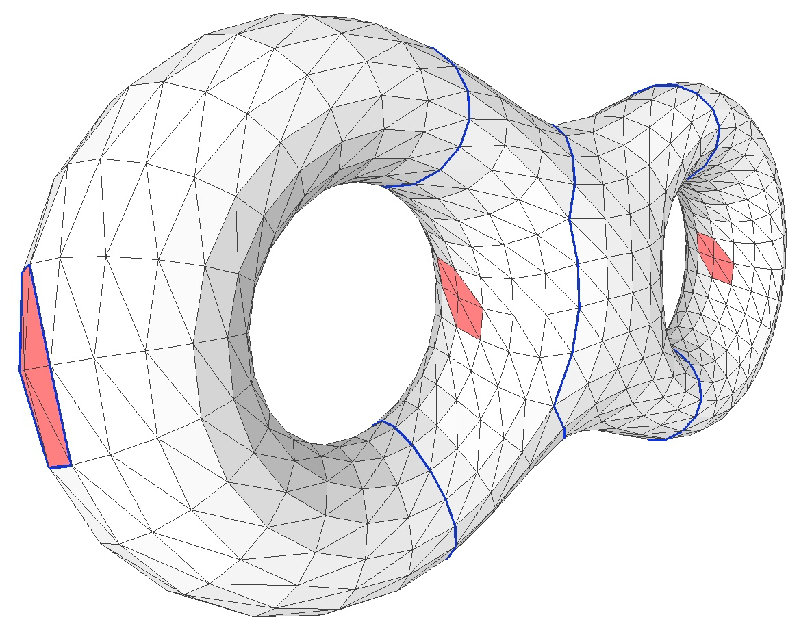

# Computing Optimal Levelset Persistent 1-Cycles for Triangular Meshes

This project implements the algorithm described in the following paper:

[Computing Optimal Persistent Cycles for Levelset Zigzag on Manifold-like Complexes](https://arxiv.org/pdf/2105.00518)

by Tamal K. Dey, Tao Hou, and Anirudh Pulavarthy. The programming language used is Python.

## Developers Information

This software is developed by Anirudh Pulavarthy under the advisory of [Tao Hou](https://taohou01.github.io/).

## About the Implementation

The implemented software computes the optimal levelset persistent 1-cycles for the **two types of intervals**, i.e., the *closed-open* and *open-open* intervals. It does the following:
- The software takes a triangular mesh in .off format as input (which must be a manifold without boundary containing a single connected component for simplicity) and builds a height function given two vertices of the mesh which are also part of the input (suppose the two vertices are given as v1, v2; then the height function is defined by taking the projection on the line containing v1, v2).
- The software then computes the critical vertices for the height function and checks whether the mesh is compatible with the function (see the paper for details). To ensure compatibility if not so in first run, the user can also specify certain critical vertices to ignore.
- After this, if the type of intervals user selects is 'open-open', then no further inputs need to be specified (there is a single open-open interval spanning the entire function values for a connected manifold; see the paper for details), and the optimal persistent cycles will be output to a .ply file with filename ending with 'oocyc'.
- If the type of intervals user selects is 'closed-open', then the user also needs to specify the number of intervals that optimal persistent cycles need to be computed for. Then, the software ranks the levelset zigzag intervals by their length and compute optimal cycles for the specified top N intervals. Each sequence of optimal cycles will be output into a single .ply file ending with 'cocyc' and the rank of the interval.

## How to Run
Simply run the following python script:

```
python lvlset_pers_cyc.py
```

In the script file `lvlset_pers_cyc.py`, you need to specify the following parameters for the program (exemplar values for the variables are provided):
- `filename="snake.off"`: the filename
- `direction=(1544, 1199)`: two vertex indices defining the direction of the height function; you are recommended to use the 'picking' functionality provided by a software such as [MeshLab](https://www.meshlab.net/) to determine the vertex indices.
- `skip_vertices=[]`: indices of critical vertices to ignore; a list of critical vertices will be provided on the first run.
- `type = "co"`: the type of intervals to compute optimal cycles for. The example one is for 'closed-open'. Use `"oo"` for 'open-open'.
- `num_of_intervals=2`: the number of (top-ranked) closed-open intervals to compute the optimal cycles for.

## Dependencies
- [PyMaxflow](https://pmneila.github.io/PyMaxflow/index.html): We used it to compute minimum cut.
- [FastZigzag](https://github.com/TDA-Jyamiti/fzz): A package for computing zigzag persistence; we used it for computing the levelset zigzag barcode.
- [Gudhi](https://gudhi.inria.fr/): A comprehensive package for topological data analysis; we mainly used the 'SimplexTree' data structure.

## Contacts

Please contact Tao Hou (taohou at uoregon dot edu) for any questions related to the software.
